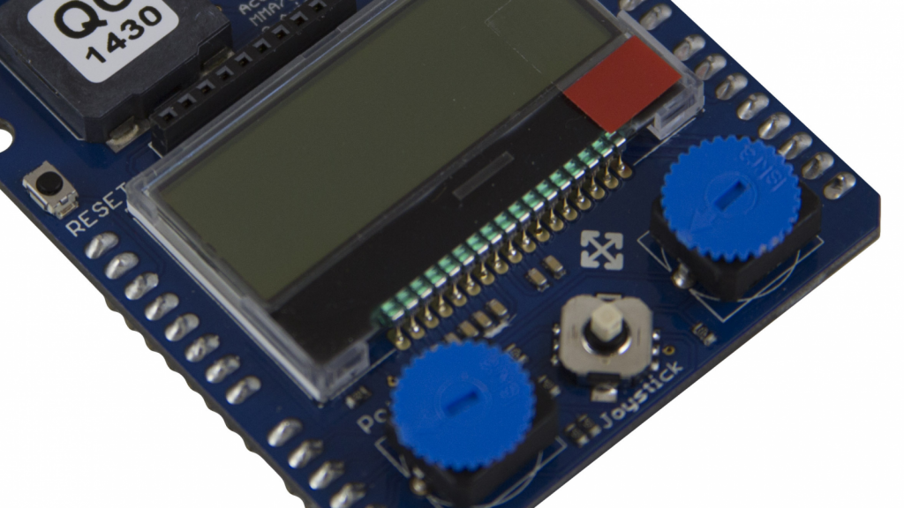
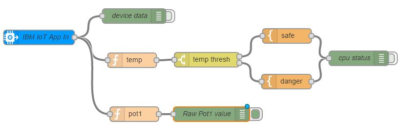

# Introduction
 
This tutorial demonstrates how to connect your ARM device to the Watson IoT Platform and prepare your development environement ont the IBM Cloud Platfrom with Node-RED and the IoT service.

# Objectives
* You will visualize your ARM data on the IBM Watson IoT Platform.
* You will use Node-RED to work with your ARM device.

# Pre-Requisites
Material:

* ARM mbed Ethernet Starter Kit containing:
  - Temperature Sensor (LM75B)
  - Accelerometer (MMA7660)
  - Potentiometer
  - Joystick

# 1. Connect the ARM device

 - Make sure your boards are plugged together. 
 - Connect to a network with internet access using an Ethernet cable. 
 - Connect to your computer using a USB cable supplied, using the connector on the board. 
 - The microcontroller appears as a drive on your computer names mbed. 
 - When you plug in your device, the connection light will initially glow yellow, while the connection is established, then turn green when the connection has been made.

 # 2. Visualize on the IoT Quickstart Platform

 - After connecting your device to the Quickstart, the next step is visualizing your data. Real-time visualization of device data can be achieved by visiting the IBM Watson IoT Platform web page specific to your platform.
 - Visit https://quickstart.internetofthings.ibmcloud.com/?deviceId=&cm_mc_uid=43056937490815104133645&cm_mc_sid_50200000=1510606767&cm_mc_sid_52640000=#/
 - Enter the Device ID (a twelve character string) in the box here and click Go to visualize your data. The Device ID can be found by scrolling down on the LCD screen using the joystick button on the board.

 # 3. Deploy your Node-RED IoT App

- Deploy the boilerplate IoT:
 
- Access your Node-RED application

Using your Node-RED work flow editor, you can configure your application to work with your connected device.

- Double click the IBM IoT App In node in your Node-RED flow editor.
    In the Authentication Type field, select Quickstart from the dropdown list.
- Enter the Device ID of your board in the Device ID field.
        The Device ID of your board can be found by scrolling down on the LCD screen using the joystick button on a connected board.
        Alternatively, the device ID of your connected mbed can be derived from the MAC address. Copy the MAC address from the visualization page, and remove the colons and make sure the letters are lowercase. For example: 01:23:45:67:89:AB becomes 0123456789ab.
- Click the Deploy button in the upper right of the Node-RED editor to deploy the changes to your flow.
    Select the debug pane on the right, you should see raw data from the sensors on your connected device. The flow should be generating Temperature Status messages. If you hold your device in your hand you should see the temperature rise.
        Note: If you can’t see both of these messages (the raw data and the temperature status messages), check that the switch on the right of both debug nodes is on.

Your Node-RED application is now processing all data from your device and generating temperature status messages using data generated by your device.

# 4. Modifying your app

Using your Node-RED work flow editor, you can modify how your application works with your connected device. These steps will demonstrate how to change the temperature threshold values for the existing flow, and how to create a subflow which extracts the data from the potentiometer1 sensor on your connected mbed device.

- Double click the temp thresh node in your Node-RED flow editor. This contains the rules that are used to determine whether the temperature is in safe limits or not in the status messages. You can modify the behaviour of the flow by:
        Changing the rules in the node, e.g. changing the threshold.
        Click OK.
        Click Deploy to change the running instance of your application.
- In order to create a new subflow that extracts the reading from the potentiometer1 sensor:
        Drag a Function node from the function section of the node palette on the left and drop it on the sheet near the IBM IoT App In node.
        Click and drag the output connector of the IBM IoT App In node to the input of the Funtion node to create a connection between them.
        Double click the Function node to open the javascript editor. Replace the existing code with the following to extract the value of potentiometer1:
        To make sure Node-RED will run when the Pi boots, setup the autostart on boot:

          return {payload:msg.payload.d.potentiometer1};
        
- Rename the node “pot1”.
- Select OK.
- Drag a Debug node from the output nodes palette. Connect the output of your “Pot1” node to the input of the Debug node and click Deploy.
        The value of the potentiometer1 sensor should now appear in the debug pane. Twisting the potentiometer on the device will cause the value to change in near real time.
        Note: potentiometer1 is the bottom left potentiometer when the device is viewed with the ethernet cable at the top.

Your flow should look similar to the following diagram.

 

