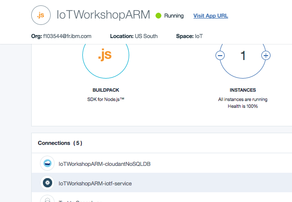
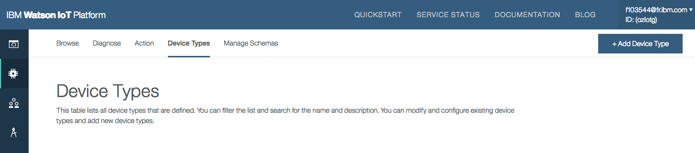
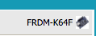

# Introduction
 

This tutorial demonstrates how to register your device into a private IBM Watson IoT Platform organisation and start sending commands to it.


# Objectives
* You will register your device to the Watson IoT platform.
* You will send commands to it.


# Pre-Requisites
Material:
*   Complete lab 1 on ARM: https://github.com/cllebrun/ibm-cloud-platform-handsOn/tree/master/labs/7.1%20Lab%20IoT%20-%20with%20ARM%201

The Watson IoT Platform within your application creates a private Internet of Things Platform organization, where you can register your device(s).

*   Open the IBM Cloud Platform Dashboard.
On the Overview tab, you should see the Watson IoT Platform listed under the Connections. 
 

*   Click on the WIoTP service and click on Launch button to launch the WIoTP Dashboard.

# 1. Adding your device to your Watson Internet of Things Organization

From the Internet of Things service dashboard, access your IoT organisation and add your device to it. 

1. Select the Devices tab on the left.
2. Select the "Device Types" tab.
 

2. Add Device Type (up and right).
3. Give it a name (for example "ARM"). Click "Next"
4. Leave the other options by default and click "Done".
5. Now you are going to register a device. Click "Register Devices"
 

6. Enter a device ID. Click Next, Next
7. Chose an identification token (8 characters minimum)
8. Click "Done"
        
5. You get your device credentials details, copy these when you get them as you will need them in the next steps. Authentication token is non-recoverable.

        Organization ID
        Device Type
        Device ID
        Authentication Method
        Authentication Token

# 2. Adding registration credentials onto the device

When you added your device to your Watson Internet of Things organization you were given device credentials. Your device will not send data to your organization until you add these credentials. You will add these using the mbed development environment.

1. You will need first to create an account to use the mbed online compiler: https://os.mbed.com/account/login/?next=/teams/IBM_IoT/ and Login

2. You can now import the source code to your mbed workspace. Navigate to the IBMWIoTPClientEthernetExample code repository: https://os.mbed.com/teams/IBM_IoT/code/IBMIoTClientEthernetExample/

3. Click ‘Import this program’ on the right. It will import the program into the online compiler

4. It will ask to chose a platform, chose "FRDM-K64F"

 

4. Expand the IBMWIoTPClientEthernetExample project and open the main.cpp file. Add the configuration details you were given when adding the device to your Internet of Things service organization.
5. The configuration details must be added using the following format:
```
  // Configuration values needed to connect to IBM IoT Cloud
  #define ORG "quickstart"             // For a registered connection, replace with "quickstart" your "org"
  #define ID ""                        // For a registered connection, replace with your id
  #define AUTH_TOKEN ""                // For a registered connection, replace with your auth-token
  #define TYPE DEFAULT_TYPE_NAME        // For a registered connection, replace DEFAULT_TYPE_NAME with your "type"

```

5. Save the above made changes to main.cpp in online compiler
6. Before compiling, ensure that the correct device target (FRDM-K64F) has been selected on the right of the online compiler toolbar (it will be its own platform).
7. Within the online compiler, click Compile and save the bin file to the mbed drive.
8. Wait for the LED to stop flashing, then when the LED is RED, press the reset button on the device, which is located to the left of the LCD screen on the top of your microcontroller. This will run the download program.
9. The device will then run in registered mode.


# 3. Link your application and registered device

Using your Node-RED work flow editor (accessed from your application URL), update the IBM IoT App In node to work with your registered device.

1. Access your Node-RED application by clicking on View App link and then choosing the option Go to you Node-RED flow editor, to access the editor.
2. Parallelly, you can also access the Node-RED editor directly by accessing the following URL
```
    http://<your-application-name>.mybluemix.net/red
```

3. Double click the IBM IoT App In node in the flow editor.
4. Ensure that the node is configured with the following parameters:
  - Authentication: Bluemix Service
  - Input Type: Device Event
  - Device Type: ALL
  - Device ID: ALL
  - Event: ALL
  - Format: ALL
5. Click OK then Deploy.
6. Look at the debug pane to see the events and messages received from the devices that are registered to your organization.
7. You can configure the IBM IoT App In node to subscribe to events from a specific device by clearing ALL and supplying the Device IC from earlier in this recipe.

# 4. Sending commands from your application

When an mbed device is running in registered mode you can send it commands from an Watson Internet of Things application. For example, the sample code that you have loadedinto the device spports a simple command that will make the device’s onboard LED blink at a specified rate.
(Look at the "messageArrived" function i your .cpp file for more details)

1. You can try this out by writing an application which connects to the Watson Internet of Things and publishes a message to the device.

2. Go to the Node-RED instance and the flow that was used earlier in the recipe. 
3. Drag and drop a "function" node. Open it, name it "blink rate" and write the following code in the function:

```
rate = Math.round(msg.payload * 5);
msg.payload = "{ \"rate\": "+rate+ " }";
return msg;

```

4. Add a debug node and an ibmiot output node after your Function node. Configure the IBM IoT App Out node:

```
  - Authentication: Bluemix Service
  - Output Type: Device Command
  - Device Type: "your device type"
  - Device ID: "your device id"
  - Command Type: blink
  - Format: json
  - Data: blink commands
  - Name: IBM IoT App Out

```

5. Wire the output of the function node that extracts the value of Pot1 to the input of the node labelled ‘blink rate’.
 

6. Select OK and Deploy.
7. Now twist potentiometer 1 (positioned to the left of the device if the ethernet cable is at the top of the device) to cause the blue LED on the main board (not the application shield with the sensors) to flash at a rate between 1 and 5 times per second, or turn it off.

Note: Sending a rate of 0 will cause the LED to stop blinking.

If you have any issue, copy the contents from github: https://raw.githubusercontent.com/ibm-messaging/iot-device-samples/master/mbed/ARM-mbed-Blink-LED.json
